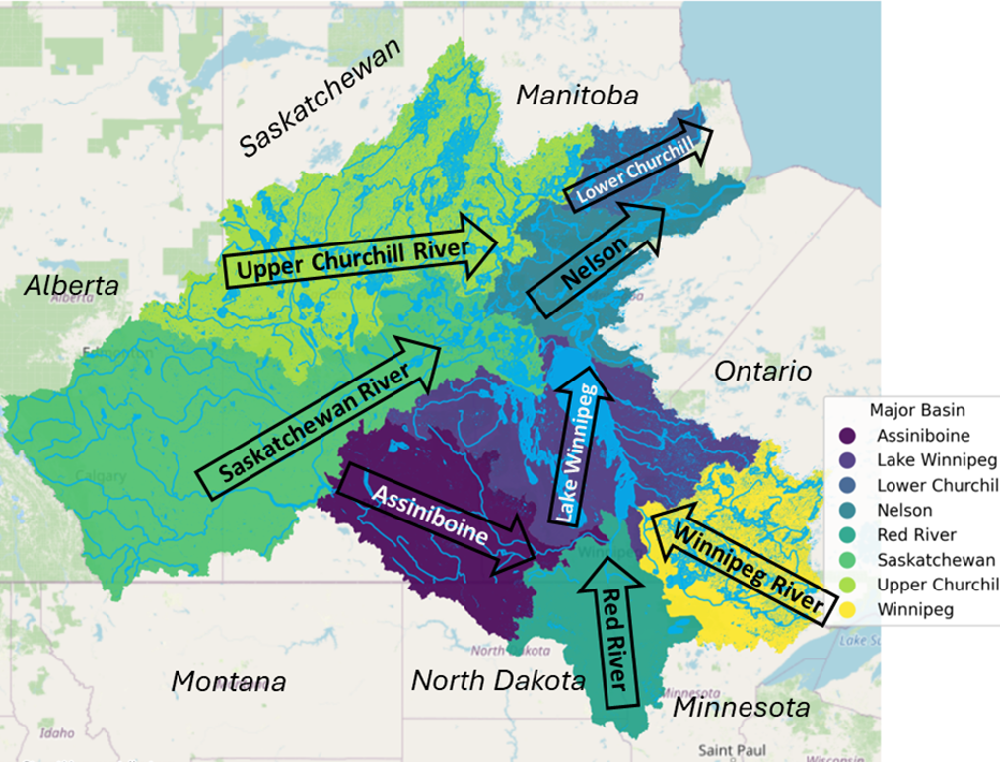
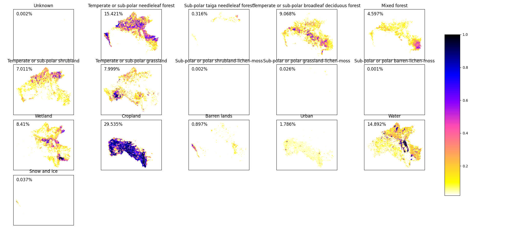

# Setting up MESH model for the Nelson-Churchill River basin

# A Comprehensive Evaluation of the MESH Model with Vector-Based Workflow for Transboundary Water Management

# Abstract
This study introduces the advancement in hydrological simulation for Nelson-Churchill River Basin (NCRB) transboundary water management through the Modélisation Environmentale Communautaire - Surface Hydrology (MESH) model, integrated with a vector-based workflow. This improvement is particularly vital for the NCRB, a transboundary and multifaceted hydrological system spanning over 1.4 million km² across several Canadian provinces and US states. The NCRB, with its diverse ecozones and significant human interaction, plays a pivotal role in agriculture, hydropower generation, and transboundary water resources management, making it a focal point for addressing future challenges, needs, and potential of transboundary waters.
Acknowledging the importance of inter-jurisdictional cooperation and data sharing, this study aligns with the objectives of the Prairie Provinces Water Board (PPWB), particularly for its Committee on Flow Forecasting, by providing an updated, vector-based basin-wide hydrological model for the NCRB. This model represents an enhancement over the existing grid-based models, offering refined hydrological simulations and predictions that are crucial for interprovincial water management and decision-making.
This presentation will highlight the NCRB's strategic importance in transboundary water management and the comprehensive evaluation of the MESH model using a vector-based workflow. The findings not only feature the model efficacy in enhancing operational hydrologic prediction and forecasting activities but also its potential in supporting transboundary water cooperation, addressing future challenges, and meeting the evolving needs of the member provinces of the PPWB.

# Land Cover Classification

